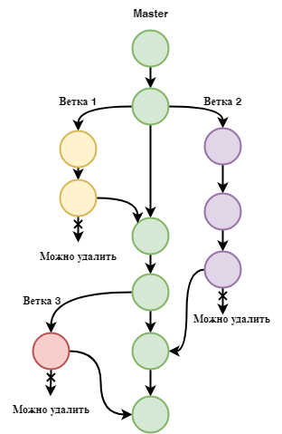

# Работа с Git

## 1. Проверка наличия установленного Git 
В терминале выполнить команду `git version`.
Если Git установлен, появится сообщение с информацией о версии программы. Иначе будет сообщение об ошибке.

## 2. Установка Git
Загружаем последнюю версию с сайта 
https://git-scm.com/downloads 
Устанавливаем с настройками по умолчанию.

## 3 . Настройка Git
При первом использовании необходимо представиться. Для этого нужно ввести в терминале 2 команды:
```
git config --global user.name "ваше имя"
git config --global user.email " ваш e-mail"
```
## 4. Инициализация репозитория
Получить репозиторий можно двумя способами.
1. Чтобы Git начал отслеживать изменения файлов в нужной папке, необходимо провести инициализацию репозитория в данной папке. Для этого, находясь в нужной папке, надо воспользоваться командой:
```
git init
```
2. Клонировать существующий репозиторий Git из любого места. Сделать это можно команой:
```
git clone <адрес репозитория>
```
## 5. Запись изменений в репозиторий
Каждый файл в рабочей папке (репозитории) может находиться в одном из двух состояний: под версионным контролем (отслеживаемый) и нет (неотслеживаемый).

Отслеживаемые файлы могут быть неизмененными, измененными или подготовленными к коммиту.

* Для начала отслеживания файла необходимо воспользоваться командой:
```
git add <имя_файла>
```
Чтобы упростить написание имени файла, можно ввести первые буквы имени и нажать кнопку **Tab**.

* Чтобы создать commit, то есть точку сохранения, используется команда:
```
git commit -m "<комментарий>"
```
*Важно!* 

Если в репозитории только один файл или мы хотим добавить коммит ко всем файлам репозитория, можно использовать единую команду, совмещающую `git add` и `git commit`:
```
git commit -am "<комментарий>"
```
Иначе надо каждый раз последовательно использовать две команды:
```
git add <имя_файла>
git commit -m "<комментарий>"
```
Можно внести исправления в комментарий к последнему коммиту. Для этого надо воспользоваться командой:
```
git commit --amend -am "<Новый комментарий>"
```
* Чтобы посмотреть текущее состояние файла, узнать, были ли изменения, не внесенные в коммит, узнать, является ли текущая папка репозиторием, используется команда:
```
git status
```
* Для того чтобы увидеть изменения между текущим состоянием и последним коммитом, можно воспользоваться коммандой:
```
git diff
```
Если изменений после добавления коммита не было, терминал ничего не покажет. Если изменения были, в терминале они будут отображаться следующим образом:
1. Красным цветом удаленные элементы.
2. Зеленым цветом добавленные элементы.
## 6. Просмотр истории коммитов
Для просмотра истории коммитов используется следующая команда:
```
git log
```
Данная команда выводит подробное перечисление всех коммитов с указанием уникального хеш-кода, именем и электронной почтой автора, даты и времени внесения и сохраненным комментарием.

Данные выводятся в многостраничном режиме, для выхода надо нажать клавишу **q**.

Для просмотра сокращенной версии можно воспользоваться командой:
```
git log --oneline
```
В этом случае будут выведены первые 7 символов номеров коммитов и комментариев к ним.

Также можно вывести на экран не все коммиты, а только требуемое количество, с помощью добавления параметра:
```
git log --oneline -<количество_коммитов>
```
Можно посмотреть разницу между всеми коммитами с помощью команды:
```
git log --oneline -p
```
Результат будет показан аналогично команде `git diff`.
## 7. Перемещение между сохранениями
Чтобы перемещаться между коммитами, используется команда:
```
git checkout <первые 4 символа номера коммита>
```
*Важно!*

Надо всегда помнить о возвращении к самому актуальному состоянию. Сделать это можно с помощью команды:
```
git checkout master
```
## 8. Игнорирование файлов

Git отслеживает все файлы и папки, расположенные в папке-репозитории. В случае если некоторые файлы (например изображения), не нуждаются в отслеживании, их можно добавить игнорирование. Для этого надо создать в основной ветке файл `.gitignore`. В нем необходимо указать имена неотслеживаемых файлов. Можно не прописывать имена всех файлов, а использовать игнорирование по расширению, заменив имя файла на звездочку, например вот так: `*.png`.

Файл `.gitignore` также необходимо добавить в отслеживание и закоммитить:
```
git add .gitignore
git commit -m "Добавили gitignore"
```

## 9. Работа с ветками и переключение между ними

Git позволяет организовать работу с проектом по типу чистовика и черновиков. Для этого используются ветки. 



Чтобы посмотреть список всех веток, надо использовать команду:
```
git branch
```
В результате выполнения команды на экран будет выведен перечень существующих веток, текущая ветка будет выделена звездочкой (*).
 
 Для создания новой ветки используется команда:
 ```
 git branch <название новой ветки>
 ```

*Важно!*

Данная команда созает новую ветку, но не переходит на нее. Чтобы перейти на нужную ветку надо использовать команду:
```
git checkout <название_ветки>
```

Чтобы создать новую ветку и сразу в нее перейти, надо использовать команду:
```
git checkout -b <название_новой_ветки>
```

При работе в ветках можно также использовать команду `git log`.  В этом случае метка **HEAD ->** будет указывать на рабочую ветку. Коммиты будут показаны также в обратном порядке от самого последнего коммита в данной ветке до первого коммитра в ветке master. В данном формате отображения не будут видны коммиты соседних веток.Соответственно в ветке master по команде  `git log` не видны коммиты остальных веток.

Посмотреть историю коммитов с визуализацией по веткам можно при помощи команды:

```
git log --graph
```

Удалить ветку можно с помощью команды:
```
git branch -d <название_ветки>
```

*Важно!*

При данном написании команды, git проводит проверку удаляемой ветки. Если в ветке были изменения, которые не были влиты в другую ветку, возникнет ошибка "**The branch is not fully merged**". Для окончательного удаления ветки надо праметр написать заглавной буквой: "`-D`".

## 10. Слияние веток и решение конфликтов

Чтобы выполнить слияние веток и перенести данные из ветки-черновика в основную ветку используется команда:
```
git merge <название_ветки>
```

*Важно!*

Данная команда добавляет данные из указанной ветки в текущую ветку, поэтому выполнять ее следует в ветке-преемнике, например в ветке master.

При выполнении слияния может возникнуть конфликт. Конфликт возникает, когда информация в строках двух сливаемых ветках сильно различается, и git не может самостоятельно определить, какой вариант оставить в конечной ветке. 

При возникловении конфликта на экране будут отражаться данные из обоих веток, отмеченные метками:
```
 <<<<<<< HEAD
 =======
 >>>>>>> other_branch
```

В этом случае надо конфликт решать самостоятельно, либо с помощью дополнительных возможностей и визуализаций (например, при работе через VSCode), выбрав из предложенных вариантов: оставить текущую версию, принять версию, которая пришла, оставить оба варианта, либо вручную. После разрешения конфликта необходимо сделать коммит для завершения слияния.
## 11. Работа с удалёнными репозиториями

Во время работы может возникнуть необходимость возможности совместной работы разных людей с одним репозиторием.
Поэтому репозитории могут быть не только локальными (расположенными на вашем компьютере), но и удаленными (расположенными на других компьютерах и серверах). 
Самым популярным сервисом, позволяющим работать с удаленными репозиториями, является GitHub.


Чтобы создать свой собственный удаленный репозиторий надо:
* Зарегистрировать аккаунт на Git Hub
* Создать удаленный репозиторий
* Создать локальный репозиторий на компьютере
* Связать локальный и удаленный репозитории с помощью следующих команд:
```
git remote add <имя для репозитория, обычно origin> <адрес репозитория>
```
*(Данная команда непосредственно связывает репозитории)*
```
git branch -M main
```
*(данная команда переименовывает основную ветку с master в main, чтобы названия веток в локальном и удаленном репозиториях совпадали)*
```
git push -u origin main
```
*(Данная команда направляет данные локального репозитория в удаленный, в таком виде команду надо писать только при первой связке репозиториев)*

*Важно!*

Не обязательно запоминать данные команды. При создании репозитория GitHub сам подскажет, какие команды надо выполнить.

При первом добавлении репозиториев из конкретного аккаунта на GitHub необходимо пройти авторизацию, потому что изменения в удаленный репозиторий может вносить только владелец.

Посмотреть список подключенных ремоут соединений можно с помощью команды:
```
git remote -v
```

Все изменения в локальный репозиторий, которые мы вносим после связывания, необходимо переносить в удаленный с помощью команды:
```
git push
```

Если в удаленный репозиторий были внесены изменения, то актуализировать состояние локального репозитория  можно с помощью команды:
```
git pull
```
*Важно!*

Данная команда составная. Она не просто копирует данные из удаленного репозитория, но и выполняет их слияние с локальным репозиторием. Таким образом может возникнуть конфликт, который решается аналогично конфликтам слияния веток.

Помимо создания нового репозитория можно произвести клонирование на локальный компьютер удаленного репозитория. 

Для этого необходимо создать папку, в которой будет располагаться проект. Из данной папки выполняем команду:
```
git clone <адрес удаленного репозитория>
```

*Важно!*

Команда `git clone` копирует репозиторий в отдельную папку, которая сама становится репозиторием, поэтому не надо клонировать репозиторий в папку, которая уже является репозиторием.

Не нужно забывать, что после команды `git clone` для дальнейшей работы с репозиторием необходимо перейти в создавшуюся папку командой:
```
cd <название папки>
```

Если мы хотим поучаствовать в каком-либо проекте, то недостаточно просто клонировать репозиторий, потому что изменения в удаленный репозиторий может вносить только владелец.

В этом случае в своем аккаунте на GitHub надо создать копию репозитория из другого аккаунта с помощью кнопки **Fork**. Таким образом мы станем владельцем данной копии и сможем вносить в нее изменения. После этого можно воспользоваться командой `git clone` и начинать работать над проектом, как над своим репозиторием.

*Важно!*

Все изменения в чужом проекте принято делать в отдельной ветке, поэтому после клонирования репозитория надо создать новую ветку, в которой и работать.

Работа с данной копией (Fork) аналогична работе с собственным репозиторием. Изменения в локальном репозитории надо переносить в удаленный с помощью команды `git push`. 

Так как мы в репозитории создавали новую ветку, при первой отправке с помощью команды `git push` Git может подсказать, что в удаленном репозитории еще нет такой ветки, поэтому надо использовать команду:

```
git push --set-upstream origin <название ветки>
```

Когда работа закончена, можно предложиь свои изменения первоначальному владельцу. Для этого после финальной заливки изменений в репозиторий в своем аккаунте, надо воспользоваться кнопкой: **Compare & pull request**. Данная кнопка обычно появляется автоматически. GitHub анализирует версии на возможность слияния, там же можно добавить сообщение и отправить запрос владельцу.

Если данная кнопка не появилась автоматически, то можно воспользоваться функцией **Pull requests** -> **New pull request**. 
